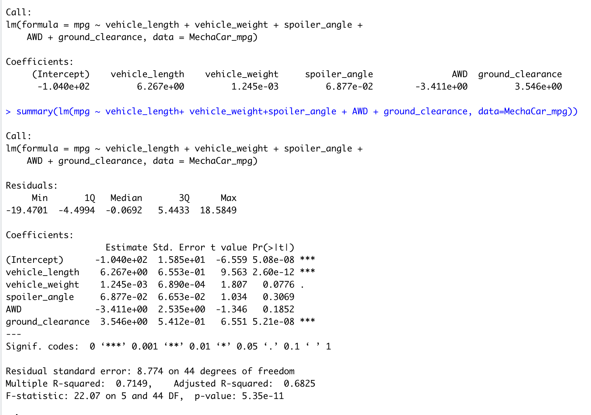
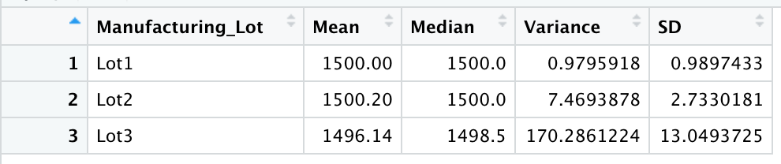
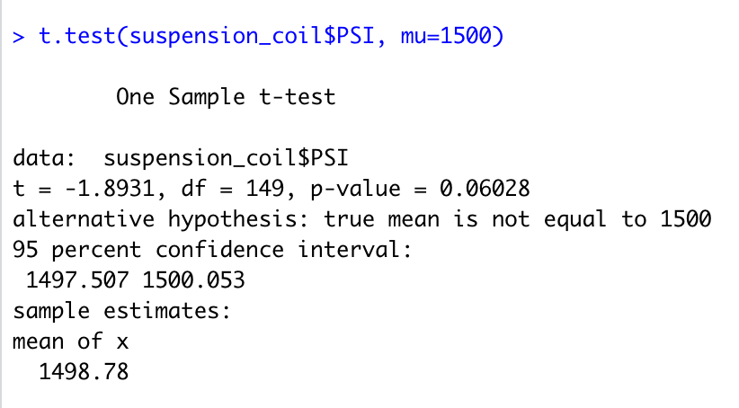
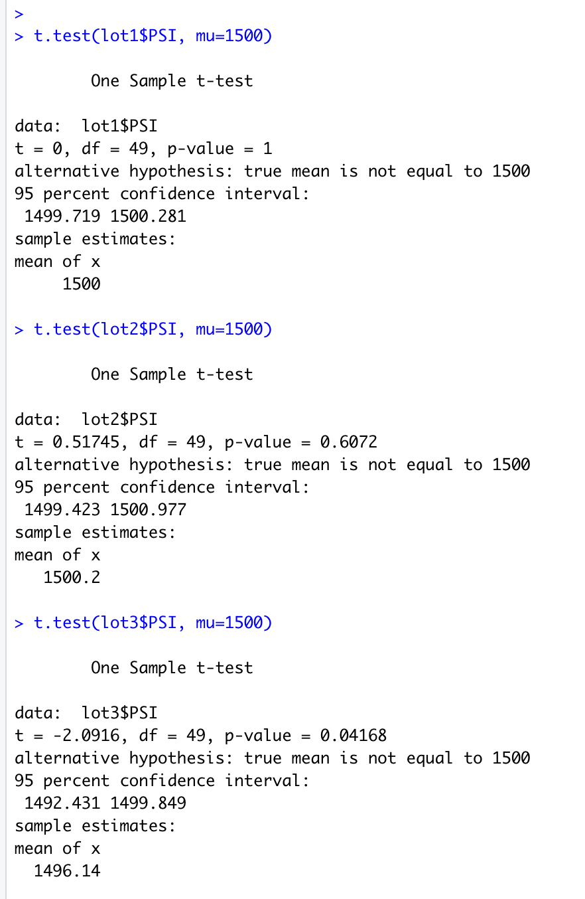

# MechaCar_Statistical_Analysis

## Project Overview
- Jeremy has been working for AutosRUs for over ten years. He is the primary data analyst for the company's data analyst team to perform a retrospective analysis of historical data, analytical verification, validation of current automotive specifications, and study design of future product testing. The most successful automobile launches utilize data analytics in every decision-making process. Therefore, the analysis must contain a statistical backbone, a quantitative metric, and a clear interpretation of the results.

- In this project, we will help Jeremy and his team perform statistical testing using the R programming language and Rstudio. Our general tasks are as below.
1. Provide summary statistics for different variables
2. Provide visualizations for different datasets
3. Provide interpretation of statistical test results.
4. Propose my study design, hypothesis, and analysis workflow with critical thinking skills, for a better AutoRUs manufacturing process.

## Linear Regression to Predict MPG
The MechaCar_mpg.csv dataset contains mpg test results for 50 prototype MechaCars. The MechaCar prototypes were produced using multiple design specifications to identify ideal vehicle performance. Multiple metrics, such as vehicle length, vehicle weight, spoiler angle, drivetrain, and ground clearance, were collected for each vehicle. We need to design a linear model that predicts the mpg of MechaCar prototypes using several variables from the MechaCar_mpg.csv file. 

- From the sample data above, we can see that Pr(>|t|) values of the vehichle_length and ground clearance are significantly smaller than 0.05. Therefore, we can reject the null hypothesis that the vehicle length and ground clearance provide a non-random amount of variance to the linear model of mpg.
- Because we reject the null hypothesis, the slope of the linear model is not zero. 
- This linear model effectively predicts the mpg of MechaCar prototypes because the R-squared is 0.715, indicating that 71.5% of the mpg variations are influenced by changes in vehicle length, weight, spoiler angle, AWD, and ground clearance.

## Summary Statistics on Suspension Coils

The MechaCar Suspension_Coil.csv dataset contains the results from multiple production lots. In this dataset, the weight capacities of multiple suspension coils were tested to determine if the manufacturing process is consistent across production lots. Using R, we created two summary tables; The first table shows the suspension coil's PSI continuous variable across all manufacturing lots, and the other is PSI metrics for each lot: mean, median, variance, and standard deviation.

- The design specifications for the MechaCar suspension coils dictate that the variance of the suspension coils must not exceed 100 pounds per square inch. 
- The overall manufacturing process seems to meet the criteria because the overall variance of the suspension coils is 62.3 pounds per square inch, which is lower than 100. However, when we look at the break-down data, we can see that Lot 1 and 2 meet the criteria, but Lot 3 has a variance of 170, which is way more than 100. Thus, the manufacturing process is inconsistent across production lots because lot 3 has a much higher variance. 

## T-Tests on Suspension Coils

In the third step, we perform t-tests to determine if all manufacturing lots and each lot separately are statistically different from the population mean of 1,500 pounds per square inch.

### T-Test across all manufacturing lots
- The T-Test result below of all manufacturing lots shows the p-value is 0.06, which is not small enough to reject the null hypothesis. And the mean is 1498.78, which is close to 1500. Thus, the PSI across all manufacturing lots is not statistically different from the population mean of 1,500 pounds per square inch.

### T-Test each manufacturing lot
- The results below show that both Lot 1 and Lot 2 have relatively high p-value (Lot 1 at one and Lot 2 at 0.61). Therefore,  manufacturing in both Lot 1 and Lot 2 is statistically similar to the population mean of 1500. (Lot 1 at 1500 and Lot 2 at 1500.2)

- However, the p-value of the Lot 3 t-test result is very small, at 0.042, which is smaller than the 0.05 significance level. And the mean of Lot 3 is 1496.14, which is also different from 1500. Thus, the manufacturing in Lot 3 is statistically different from the population mean of 1500.

## Study Design: MechaCar vs. Competition

- To make MechaCar more competitive in the market, we need to focus on improving areas that customers care about. As the gas price goes through the roof, increasing the miles-per-gallon (mpg) number and fuel efficiency would attract more customers. 

- Using one-way t-test to check the mean of mpg of similar type of vehicle between MechaCar and other brands. Here, we need identical vehicle types with close parameters like vehicle weight, size, and price.

- We will compare the mean of mpg between MechaCar and the population mean. The null hypothesis is that the brand has nothing to do with mpg. Suppose our test results show that the mpg of MechaCar is significantly higher than the population mean (the p-value should be smaller than 0.05 to reject the null hypothesis). That indicates that MechaCar is a brand that provides better fuel efficiency.

